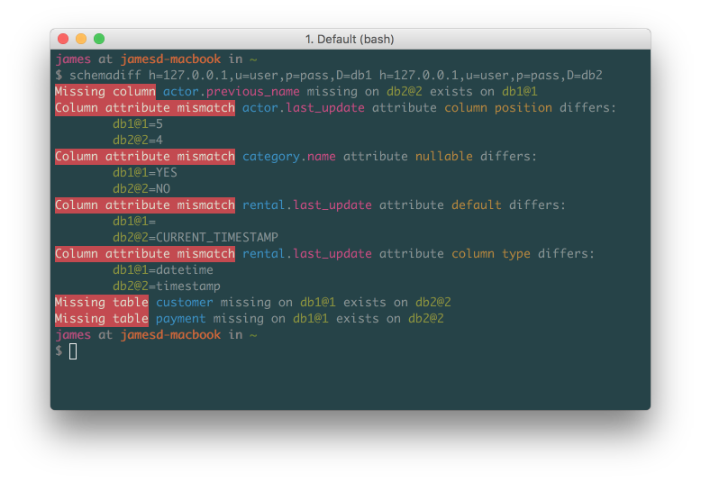
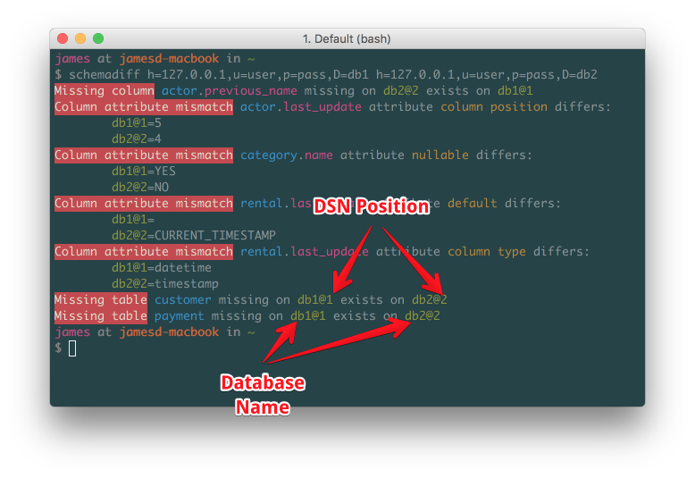
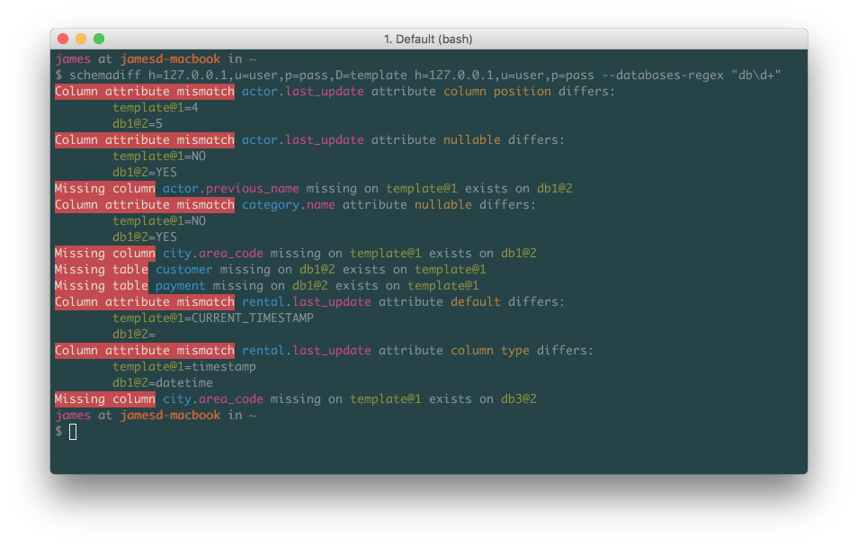

# phlib/schemadiff

[](https://github.com/phlib/schemadiff/actions/workflows/code-checks.yml)
[](https://codecov.io/gh/phlib/schemadiff)
[](https://packagist.org/packages/phlib/schemadiff)
[](https://packagist.org/packages/phlib/schemadiff)


MySQL Schema Diff, a Symfony Console tool for displaying differeance between two schemas. This can be useful by showing differences between production and development. It's then up to the developer to create some kind of migration scripts.

## Install

Via Composer

Single project
``` bash
$ composer require phlib/schemadiff
```

Globally
``` bash
$ composer global require phlib/schemadiff
```

## Command Line Usage

If you install schemadiff globally

And add this to your PATH in your ~/.bash_profile
``` bash
export PATH=~/.composer/vendor/bin:$PATH
```

Then you can run schemadiff like this
``` bash 
$ schemadiff --help
$ schemadiff h=127.0.0.1,u=user,p=pass,D=db1 h=127.0.0.1,u=user,p=pass,D=db2
```

Otherwise run it from your project
``` bash
$ ./vendor/bin/schemadiff --help
$ ./vendor/bin/schemadiff h=127.0.0.1,u=user,p=pass,D=db1 h=127.0.0.1,u=user,p=pass,D=db2
```

## PHP Usage
``` php
<?php

$pdo = new \PDO('mysql:...', $username, $password);
$schemaInfo1 = \Phlib\SchemaDiff\SchemaInfoFactory::fromPdo($pdo, 'db1');
$schemaInfo2 = \Phlib\SchemaDiff\SchemaInfoFactory::fromPdo($pdo, 'db2');

$schemaDiff = new \Phlib\SchemaDiff\SchemaDiff(
    new Symfony\Component\Console\Output\StreamOutput(STDOUT)
);
$different = $schemaDiff->diff($schemaInfo1, $schemaInfo2);

exit($different ? 1 : 0);

```

## Example Ouput

Output shows difference between the schemas.


As the database names could be the same on different hosts, the DSN position is included.


Testing different copies match a tempalte database.


## License

This package is free software: you can redistribute it and/or modify
it under the terms of the GNU Lesser General Public License as published by
the Free Software Foundation, either version 3 of the License, or
(at your option) any later version.

This program is distributed in the hope that it will be useful,
but WITHOUT ANY WARRANTY; without even the implied warranty of
MERCHANTABILITY or FITNESS FOR A PARTICULAR PURPOSE.  See the
GNU Lesser General Public License for more details.

You should have received a copy of the GNU Lesser General Public License
along with this program.  If not, see <http://www.gnu.org/licenses/>.
